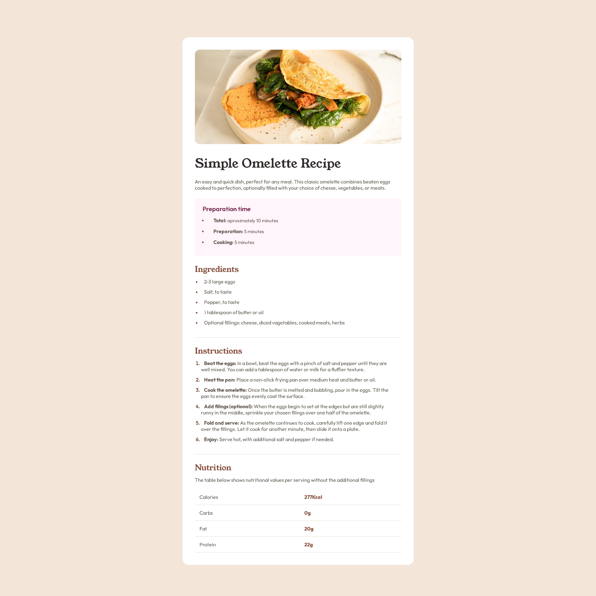
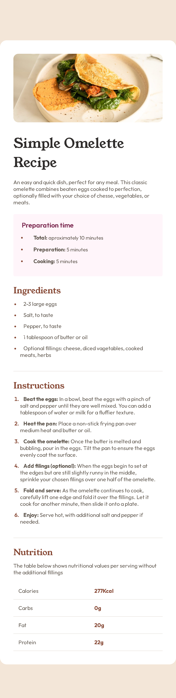

# Frontend Mentor - Recipe page solution

This is a solution to the [Recipe page challenge on Frontend Mentor](https://www.frontendmentor.io/challenges/recipe-page-KiTsR8QQKm). Frontend Mentor challenges help you improve your coding skills by building realistic projects. 

## Table of contents

- [Overview](#overview)
  - [The challenge](#the-challenge)
  - [Screenshot](#screenshot)
  - [Links](#links)
- [My process](#my-process)
  - [Built with](#built-with)
  - [What I learned](#what-i-learned)
  - [Continued development](#continued-development)
  - [Useful resources](#useful-resources)
- [Author](#author)
- [Acknowledgments](#acknowledgments)

## Overview

### Screenshot





### Links

- Solution URL: [Recipe page](https://gugupx.github.io/Recipe-page-Frontend-mentor/)

## My process

### Built with

- Semantic HTML5 markup
- CSS custom properties
- Flexbox

### What I learned

I’m using what I’ve learned in HTML and CSS to fully solidify the content in my mind, and this project served as a way to refresh basic concepts that I had overlooked. I managed to finish it in 12 hours, and for my first project, I’m happy with the result.

I had a bit of trouble adding this table because I didn't know how to make it horizontal, but after some research, I managed to figure it out.:

```html
  <table class="table-nutition">
                    <tr>
                        <th>Calories</th>
                        <td>277Kcal</td>
                    </tr>
                    <tr>
                        <th>Carbs</th>
                        <td>0g</td>
                    </tr>
                    <tr>
                        <th>Fat</th>
                        <td>20g</td>
                    </tr>
                    <tr>
                        <th>Protein</th>
                        <td>22g</td>
                    </tr>
                </table>
```

### Continued development

I'm learning Frontend to strengthen the concepts and enter programming in a more relaxed way, but I have a strong interest in Backend, probably due to my autism lol.


### Useful resources

- [W3schools](https://www.w3schools.com/html/html_tables.asp) - o w3schools me ajudou muito com os problemas da table recomendo muito

## Author

- Frontend Mentor - [@GuguPx](https://www.frontendmentor.io/profile/GuguPx)

## Acknowledgments

I would like to thank W3Schools a lot, which helped me a lot, and ChatGPT, which helped me look at my project with a different perspective.
P.S.: I didn’t use any code from ChatGPT or anything like that, I only used it to ask some questions about certain properties.
